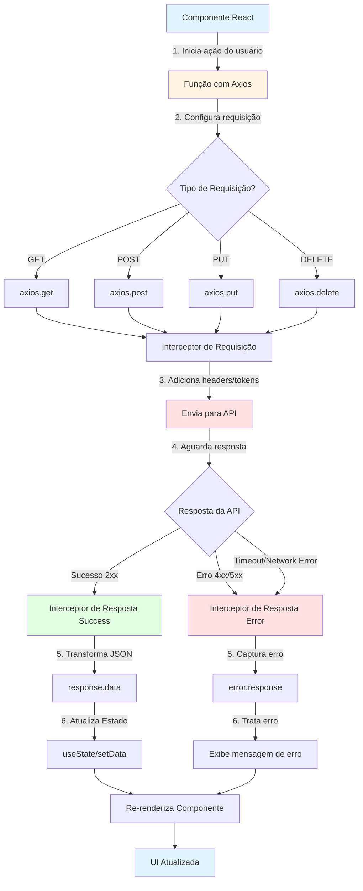
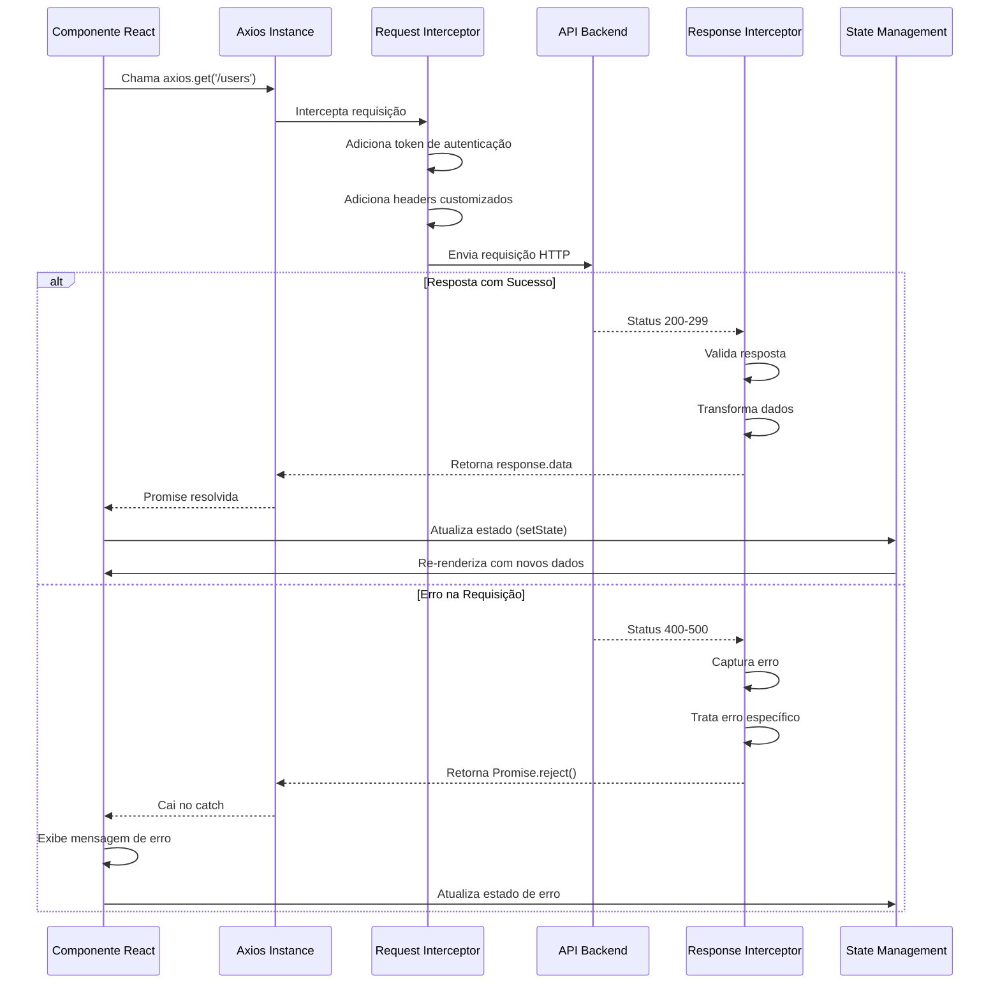

# AXIOS - Resumo para Aplicações React

## O que é Axios?

Axios é uma biblioteca JavaScript baseada em Promises para fazer requisições HTTP tanto no navegador quanto no Node.js. É uma das ferramentas mais populares para comunicação com APIs em aplicações React.

## Para que serve o Axios?

### 1. **Comunicação com APIs REST**
- Facilita a comunicação entre o frontend (React) e o backend (API)
- Permite fazer requisições GET, POST, PUT, DELETE, PATCH, etc.

### 2. **Principais Vantagens**
- ✅ **Sintaxe simples e intuitiva**
- ✅ **Suporte nativo a Promises e async/await**
- ✅ **Transformação automática de JSON**
- ✅ **Interceptors para requisições e respostas**
- ✅ **Tratamento de erros simplificado**
- ✅ **Cancelamento de requisições**
- ✅ **Proteção contra XSRF**
- ✅ **Timeout configurável**

### 3. **Casos de Uso Comuns**
- Buscar dados de uma API (GET)
- Enviar formulários (POST)
- Atualizar informações (PUT/PATCH)
- Deletar registros (DELETE)
- Upload de arquivos
- Autenticação com tokens

## Instalação

```bash
npm install axios
# ou
yarn add axios
```

## Exemplo Básico

```javascript
import axios from 'axios';

// GET - Buscar dados
const fetchData = async () => {
  try {
    const response = await axios.get('https://api.exemplo.com/users');
    console.log(response.data);
  } catch (error) {
    console.error('Erro:', error);
  }
};

// POST - Enviar dados
const createUser = async (userData) => {
  try {
    const response = await axios.post('https://api.exemplo.com/users', userData);
    console.log(response.data);
  } catch (error) {
    console.error('Erro:', error);
  }
};
```

## Configuração Global (Instância)

```javascript
const api = axios.create({
  baseURL: 'https://api.exemplo.com',
  timeout: 5000,
  headers: {
    'Content-Type': 'application/json',
    'Authorization': `Bearer ${token}`
  }
});
```

## Fluxograma do Fluxo de Requisições com Axios



## Fluxo Detalhado com Interceptors



## Ciclo Completo em uma Aplicação React


## Boas Práticas

1. **Criar uma instância centralizada**
   - Evita repetição de código
   - Facilita manutenção

2. **Usar interceptors**
   - Para adicionar tokens automaticamente
   - Para tratamento global de erros

3. **Implementar tratamento de erros**
   - Sempre use try/catch ou .catch()
   - Forneça feedback ao usuário

4. **Usar estados de loading**
   - Melhora a experiência do usuário
   - Indica quando dados estão sendo carregados

5. **Cancelar requisições quando necessário**
   - Evita memory leaks
   - Use AbortController ou CancelToken

## Exemplo Completo com React

```javascript
import { useState, useEffect } from 'react';
import axios from 'axios';

function UsersList() {
  const [users, setUsers] = useState([]);
  const [loading, setLoading] = useState(true);
  const [error, setError] = useState(null);

  useEffect(() => {
    const fetchUsers = async () => {
      try {
        setLoading(true);
        const response = await axios.get('https://api.exemplo.com/users');
        setUsers(response.data);
        setError(null);
      } catch (err) {
        setError(err.message);
      } finally {
        setLoading(false);
      }
    };

    fetchUsers();
  }, []);

  if (loading) return <p>Carregando...</p>;
  if (error) return <p>Erro: {error}</p>;

  return (
    <ul>
      {users.map(user => (
        <li key={user.id}>{user.name}</li>
      ))}
    </ul>
  );
}
```

## Resumo

Axios é essencial em aplicações React modernas para:
- **Simplificar** a comunicação com APIs
- **Padronizar** requisições HTTP
- **Melhorar** o tratamento de erros
- **Otimizar** o gerenciamento de estados de loading/error
- **Facilitar** a manutenção do código

Com Axios, você transforma requisições complexas em código limpo e fácil de entender! 🚀

