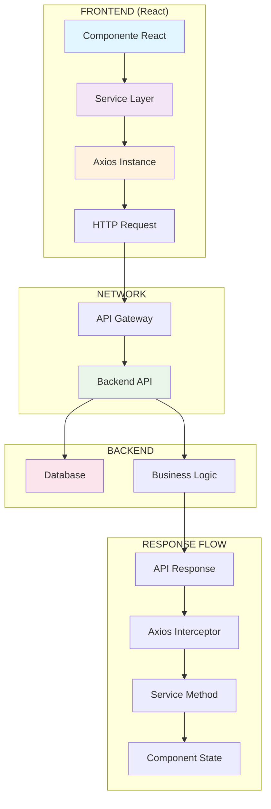

# Conceito de SERVICES - Conexão Front-end e Backend

## O que são Services?

**Services** são camadas de abstração que atuam como intermediários entre o front-end (interface do usuário) e as APIs do backend. Eles encapsulam toda a lógica de comunicação com APIs externas, centralizando as requisições HTTP e fornecendo uma interface limpa para os componentes React.

## Por que usar Services?

### 1. **Separação de Responsabilidades**
- Os componentes React focam apenas na apresentação e interação do usuário
- A lógica de comunicação com APIs fica isolada nos services
- Facilita manutenção e testes

### 2. **Reutilização de Código**
- Um service pode ser usado por múltiplos componentes
- Evita duplicação de código de requisições HTTP
- Centraliza configurações comuns (URLs, headers, interceptors)

### 3. **Tratamento Centralizado de Erros**
- Interceptors do Axios para tratamento global de erros
- Logs centralizados para debugging
- Fallbacks e retry automático

### 4. **Configuração Unificada**
- Base URL centralizada
- Headers padrão (Content-Type, Authorization)
- Timeouts e configurações de rede

## Arquitetura de Services



## Estrutura de um Service

### 1. **Configuração do Axios** (`config/axios.ts`)
```typescript
import axios from 'axios';

const api = axios.create({
  baseURL: 'https://api.escuelajs.co/api/v1',
  timeout: 10000,
  headers: {
    'Content-Type': 'application/json',
  },
});

// Interceptors para tratamento global
api.interceptors.request.use(/* ... */);
api.interceptors.response.use(/* ... */);

export default api;
```

### 2. **Tipos TypeScript** (`type/clientes.ts`)
```typescript
export interface Cliente {
  id: number;
  email: string;
  name: string;
  role: 'customer' | 'admin';
  avatar: string;
  creationAt: string;
  updatedAt: string;
}
```

### 3. **Service Layer** (`services/clientes.services.ts`)
```typescript
import api from '../config/axios';
import { Cliente, ClientesResponse } from '../type/clientes';

export const clientesService = {
  // Buscar todos os clientes
  async getAll(): Promise<Cliente[]> {
    const response = await api.get<ClientesResponse>('/users');
    return response.data;
  },

  // Buscar cliente por ID
  async getById(id: number): Promise<Cliente> {
    const response = await api.get<Cliente>(`/users/${id}`);
    return response.data;
  },

  // Criar novo cliente
  async create(cliente: Omit<Cliente, 'id'>): Promise<Cliente> {
    const response = await api.post<Cliente>('/users', cliente);
    return response.data;
  },

  // Atualizar cliente
  async update(id: number, cliente: Partial<Cliente>): Promise<Cliente> {
    const response = await api.put<Cliente>(`/users/${id}`, cliente);
    return response.data;
  },

  // Deletar cliente
  async delete(id: number): Promise<void> {
    await api.delete(`/users/${id}`);
  }
};
```

## Fluxo de Dados

### 1. **Requisição (Request Flow)**
1. Usuário interage com componente React
2. Componente chama método do service
3. Service faz requisição HTTP via Axios
4. Interceptors processam headers e autenticação
5. Requisição é enviada para API do backend

### 2. **Resposta (Response Flow)**
1. Backend processa requisição e retorna dados
2. Axios recebe resposta HTTP
3. Interceptors processam resposta (logs, tratamento de erros)
4. Service retorna dados tipados para componente
5. Componente atualiza estado e re-renderiza

## Vantagens da Arquitetura

### ✅ **Manutenibilidade**
- Mudanças na API afetam apenas os services
- Fácil atualização de endpoints
- Versionamento centralizado

### ✅ **Testabilidade**
- Services podem ser testados independentemente
- Mocking facilitado para testes unitários
- Isolamento de dependências externas

### ✅ **Performance**
- Cache de requisições
- Interceptors para otimizações
- Lazy loading de dados

### ✅ **Segurança**
- Centralização de tokens de autenticação
- Validação de dados antes do envio
- Sanitização de respostas

## Boas Práticas

### 1. **Nomenclatura Consistente**
- Services: `nomeService.ts` (ex: `clientesService`)
- Métodos: `getAll()`, `getById()`, `create()`, `update()`, `delete()`

### 2. **Tratamento de Erros**
- Try/catch nos componentes
- Fallbacks para estados de erro
- Loading states durante requisições

### 3. **Tipagem Forte**
- Interfaces TypeScript para todos os dados
- Tipos de resposta específicos
- Validação de dados recebidos

### 4. **Organização de Arquivos**
```
src/
├── services/
│   ├── clientes.service.ts
│   ├── produtos.service.ts
│   └── vendas.service.ts
├── type/
│   ├── clientes.ts
│   ├── produtos.ts
│   └── vendas.ts
└── config/
    └── axios.ts
```

## Exemplo Prático de Uso

```typescript
// No componente React
import { useState, useEffect } from 'react';
import { clientesService } from '../services/clientes.service';
import { Cliente } from '../type/clientes';

export default function ClientesPage() {
  const [clientes, setClientes] = useState<Cliente[]>([]);
  const [loading, setLoading] = useState(true);
  const [error, setError] = useState<string | null>(null);

  useEffect(() => {
    const fetchClientes = async () => {
      try {
        setLoading(true);
        const dados = await clientesService.getAll();
        setClientes(dados);
      } catch (err) {
        setError('Erro ao carregar clientes');
      } finally {
        setLoading(false);
      }
    };

    fetchClientes();
  }, []);

  if (loading) return <div>Carregando...</div>;
  if (error) return <div>Erro: {error}</div>;

  return (
    <div>
      {clientes.map(cliente => (
        <div key={cliente.id}>{cliente.name}</div>
      ))}
    </div>
  );
}
```

## Conclusão

Os **Services** são fundamentais para criar aplicações React escaláveis e maintíveis. Eles atuam como uma camada de abstração que:

- **Simplifica** a comunicação com APIs
- **Centraliza** configurações e tratamento de erros
- **Facilita** testes e manutenção
- **Melhora** a experiência do desenvolvedor

Esta arquitetura permite que o front-end seja mais robusto, organizado e preparado para crescer junto com as necessidades do negócio.
