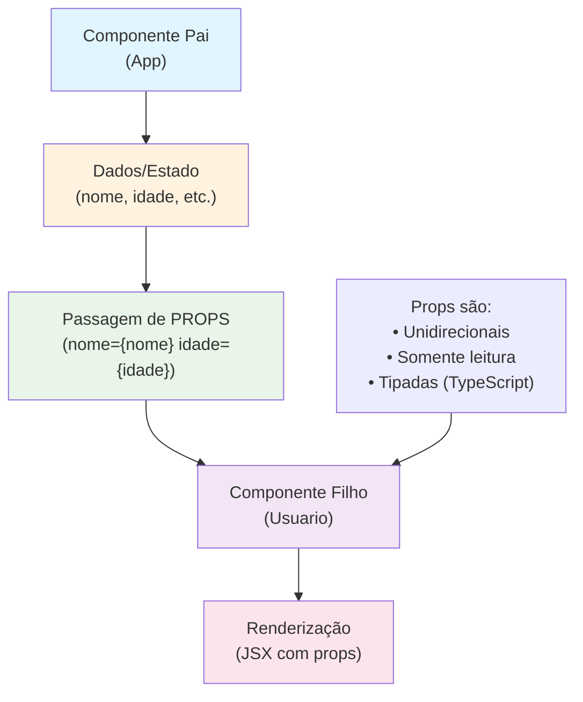

# PROPS no React

## O que são PROPS?

**PROPS** (abreviação de "properties") são uma forma de passar dados de um componente pai para um componente filho no React. É como se fossem "parâmetros" que você passa para uma função, mas no contexto de componentes React.

## Características principais:

- **Unidirecionais**: Os dados fluem apenas do componente pai para o filho
- **Somente leitura**: O componente filho não pode modificar as props recebidas
- **Tipagem**: Podem ser tipadas com TypeScript para maior segurança
- **Flexibilidade**: Permitem criar componentes reutilizáveis

## Exemplo básico:

```tsx
// Componente pai
function App() {
  const nome = "João";
  const idade = 25;
  
  return <Usuario nome={nome} idade={idade} />;
}

// Componente filho
function Usuario({ nome, idade }) {
  return (
    <div>
      <h1>Nome: {nome}</h1>
      <p>Idade: {idade}</p>
    </div>
  );
}
```

## Fluxo de dados com PROPS:



## Vantagens das PROPS:

1. **Reutilização**: Componentes podem ser usados com dados diferentes
2. **Manutenibilidade**: Mudanças no pai afetam automaticamente os filhos
3. **Testabilidade**: Fácil de testar com diferentes valores
4. **Organização**: Separação clara de responsabilidades

## Exemplo prático no projeto:

```tsx
// Componente pai passa dados
<ClientesTable 
  clientes={listaClientes} 
  onEdit={handleEdit} 
  onDelete={handleDelete} 
/>

// Componente filho recebe e usa
function ClientesTable({ clientes, onEdit, onDelete }) {
  return (
    <table>
      {clientes.map(cliente => (
        <tr key={cliente.id}>
          <td>{cliente.nome}</td>
          <td>
            <button onClick={() => onEdit(cliente)}>Editar</button>
            <button onClick={() => onDelete(cliente.id)}>Excluir</button>
          </td>
        </tr>
      ))}
    </table>
  );
}
```

## Dicas importantes:

- **Sempre tipar props** com TypeScript para evitar erros
- **Usar nomes descritivos** para as props
- **Evitar passar muitas props** - considere usar Context API
- **Props são imutáveis** - não tente modificá-las no componente filho

