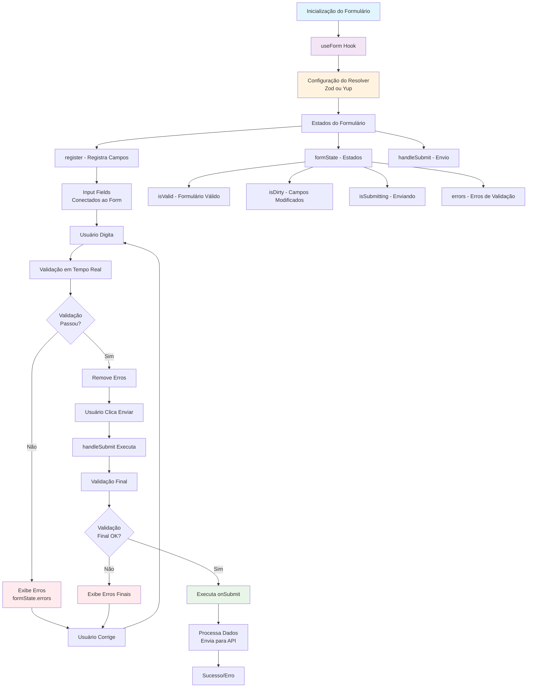

# React Hook Form

## O que é o React Hook Form?

O React Hook Form é uma biblioteca que facilita o gerenciamento de formulários em React. Ele oferece:

- **Performance otimizada** - Re-renderizações mínimas
- **Validação simples** - Integração com bibliotecas de validação
- **API intuitiva** - Hooks fáceis de usar
- **Menos código** - Reduz boilerplate

## Hooks Principais

### useForm()
Hook principal que retorna métodos e estados do formulário:

```typescript
const { register, handleSubmit, formState: { errors } } = useForm();
```

- `register`: Registra campos do formulário
- `handleSubmit`: Gerencia o envio do formulário
- `formState.errors`: Contém erros de validação

### register()
Conecta campos de input ao formulário:

```typescript
<input {...register("nome")} />
```

### handleSubmit()
Executa função quando formulário é enviado:

```typescript
const onSubmit = (data) => {
  console.log(data); // Dados do formulário
};

<form onSubmit={handleSubmit(onSubmit)}>
```

## Validação com Zod

Zod é uma biblioteca de validação TypeScript-first:

```typescript
import { z } from "zod";
import { zodResolver } from "@hookform/resolvers/zod";

// Schema de validação
const schema = z.object({
  nome: z.string().min(2, "Nome deve ter pelo menos 2 caracteres"),
  email: z.string().email("Email inválido"),
  idade: z.number().min(18, "Idade mínima é 18 anos")
});

// Configuração do formulário
const { register, handleSubmit, formState: { errors } } = useForm({
  resolver: zodResolver(schema)
});
```

## Validação com Yup

Yup é uma biblioteca de validação JavaScript:

```typescript
import * as yup from "yup";
import { yupResolver } from "@hookform/resolvers/yup";

// Schema de validação
const schema = yup.object({
  nome: yup.string().required("Nome é obrigatório"),
  email: yup.string().email("Email inválido").required("Email é obrigatório"),
  idade: yup.number().min(18, "Idade mínima é 18 anos")
});

// Configuração do formulário
const { register, handleSubmit, formState: { errors } } = useForm({
  resolver: yupResolver(schema)
});
```

## Vantagens do React Hook Form

1. **Performance**: Re-renderiza apenas quando necessário
2. **Validação**: Integração nativa com bibliotecas de validação
3. **Simplicidade**: API intuitiva e fácil de aprender
4. **Flexibilidade**: Funciona com qualquer biblioteca de UI
5. **TypeScript**: Suporte completo ao TypeScript

## Exemplo Prático

```typescript
import { useForm } from "react-hook-form";
import { zodResolver } from "@hookform/resolvers/zod";
import { z } from "zod";

const schema = z.object({
  nome: z.string().min(2, "Nome muito curto"),
  email: z.string().email("Email inválido")
});

export function MeuFormulario() {
  const { register, handleSubmit, formState: { errors } } = useForm({
    resolver: zodResolver(schema)
  });

  const onSubmit = (data) => {
    console.log("Dados:", data);
  };

  return (
    <form onSubmit={handleSubmit(onSubmit)}>
      <input {...register("nome")} placeholder="Nome" />
      {errors.nome && <span>{errors.nome.message}</span>}
      
      <input {...register("email")} placeholder="Email" />
      {errors.email && <span>{errors.email.message}</span>}
      
      <button type="submit">Enviar</button>
    </form>
  );
}
```

## Quando usar Zod vs Yup?

### Zod
- ✅ TypeScript-first
- ✅ Inferência de tipos automática
- ✅ Mais moderno
- ✅ Melhor performance

### Yup
- ✅ Mais maduro
- ✅ Mais opções de validação
- ✅ Melhor para projetos JavaScript puro
- ✅ Documentação mais extensa

## Fluxograma do Funcionamento


