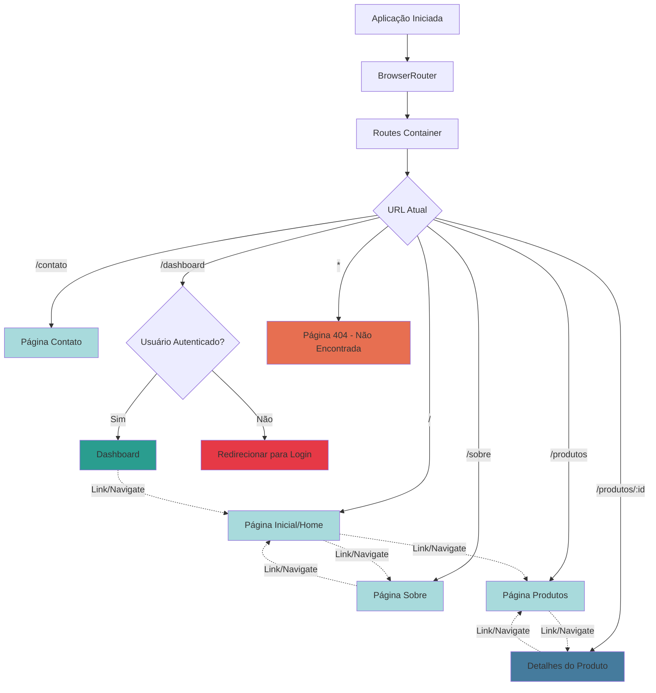

# React Router DOM

## O que é?

React Router DOM é uma biblioteca de roteamento para aplicações React que permite a navegação entre diferentes páginas/views sem recarregar a página inteira (SPA - Single Page Application).

## Para que serve?

- **Navegação entre páginas**: Permite criar múltiplas rotas na aplicação
- **URLs dinâmicas**: Suporta parâmetros de rota (ex: `/usuario/:id`)
- **Navegação programática**: Permite redirecionar usuários via código
- **Nested Routes**: Permite rotas aninhadas (rotas dentro de rotas)
- **Proteção de rotas**: Facilita a criação de rotas privadas/protegidas
- **Browser History**: Mantém o histórico de navegação do navegador funcionando

## Componentes Principais

- `BrowserRouter`: Envolve toda a aplicação para habilitar o roteamento
- `Routes`: Container para todas as rotas
- `Route`: Define uma rota específica
- `Link`: Componente para criar links de navegação
- `Navigate`: Redireciona para outra rota
- `useNavigate`: Hook para navegação programática
- `useParams`: Hook para acessar parâmetros da URL
- `Outlet`: Renderiza rotas filhas aninhadas

## Fluxograma de Navegação



## Exemplo Básico de Uso

```tsx
import { BrowserRouter, Routes, Route, Link } from 'react-router-dom';

function App() {
  return (
    <BrowserRouter>
      <nav>
        <Link to="/">Home</Link>
        <Link to="/sobre">Sobre</Link>
      </nav>
      
      <Routes>
        <Route path="/" element={<Home />} />
        <Route path="/sobre" element={<Sobre />} />
        <Route path="/produtos/:id" element={<Produto />} />
        <Route path="*" element={<NotFound />} />
      </Routes>
    </BrowserRouter>
  );
}
```

## Vantagens

✅ Navegação rápida sem reload da página  
✅ Melhor experiência do usuário (UX)  
✅ Mantém o estado da aplicação  
✅ Suporta navegação com botões voltar/avançar do navegador  
✅ URLs amigáveis e compartilháveis  
✅ Lazy loading de componentes por rota

