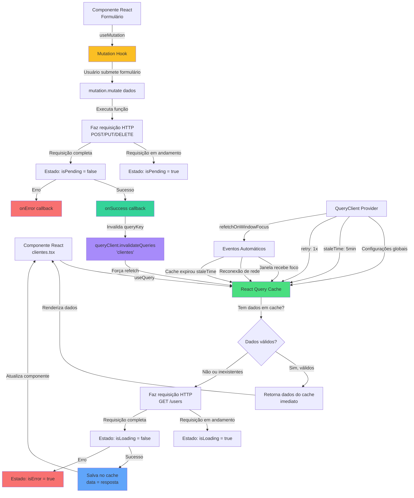

# O que é React Query?

**React Query** (também conhecido como TanStack Query) é uma biblioteca poderosa para gerenciar o estado de dados assíncronos em aplicações React. Ela simplifica muito o trabalho de buscar dados de APIs, gerenciar cache, atualizar informações e lidar com estados de loading e erro.

## Conceitos Básicos

### Query (Consulta)
**Query** é usado para **buscar dados** do servidor. É como fazer uma pergunta e receber uma resposta.

- **useQuery**: Hook usado para buscar dados que não mudam com frequência
- **Cache**: React Query guarda os dados em cache para não precisar buscar novamente
- **Refetch**: Pode atualizar os dados automaticamente quando necessário

### Mutation (Mutação)
**Mutation** é usado para **modificar dados** no servidor (criar, atualizar, deletar).

- **useMutation**: Hook usado para operações que mudam dados (POST, PUT, DELETE)
- **onSuccess/onError**: Callbacks para quando a operação termina
- **Invalidation**: Pode invalidar queries para atualizar a lista automaticamente

## Principais Vantagens

✅ **Cache Inteligente**: Guarda dados e evita requisições desnecessárias  
✅ **Estados Automáticos**: Gerencia loading, error e success automaticamente  
✅ **Refetch Automático**: Atualiza dados quando a janela recebe foco ou reconecta  
✅ **Sincronização**: Mantém dados atualizados entre vários componentes  
✅ **Menos Código**: Não precisa gerenciar useState para loading/error manualmente

## Como Funciona na Prática

1. **useQuery** para buscar lista de clientes:
   - Componente chama `useQuery` com uma chave única (`queryKey`)
   - React Query verifica se tem os dados em cache
   - Se não tiver ou estiver desatualizado, faz a requisição
   - Retorna `data`, `isLoading`, `isError`, etc.

2. **useMutation** para criar/editar/deletar:
   - Componente chama `useMutation` com função que faz a requisição
   - Quando o usuário clica em "Salvar", chama `mutation.mutate()`
   - React Query gerencia o estado da operação
   - Pode invalidar a query para atualizar a lista automaticamente

## Exemplo no Projeto

No nosso projeto, estamos usando `useQuery` para buscar a lista de clientes:

```typescript
const { data: clientesQuery, isLoading, isError } = useQuery({
  queryKey: ['clientes'],
  queryFn: () => clientesService.getAll(),
});
```

Isso automaticamente:
- Busca os clientes quando o componente monta
- Mostra loading enquanto busca
- Guarda em cache por 5 minutos
- Atualiza quando a janela recebe foco

---

## Fluxograma: Fluxo de Dados entre Componentes React e React Query



## Explicação Detalhada do Fluxo

### 1. Fluxo de Query (Buscar Dados) - Cores Verde/Azul

1. **Componente Solicita (Verde)**: Componente usa `useQuery` com uma `queryKey` única
2. **Verificação de Cache**: React Query verifica se já tem os dados em cache
3. **Cache Hit**: Se dados estão válidos, retorna imediatamente (super rápido!)
4. **Cache Miss**: Se não tem ou está desatualizado, faz requisição HTTP
5. **Estados Automáticos**: Durante a requisição, `isLoading = true`
6. **Salvamento**: Dados são salvos no cache e o componente é atualizado

### 2. Fluxo de Mutation (Modificar Dados) - Cores Amarelo/Roxo/Verde

1. **Hook de Mutation (Amarelo)**: Componente cria mutation com `useMutation`
2. **Submissão**: Quando usuário salva, chama `mutation.mutate(dados)`
3. **Requisição**: Faz POST/PUT/DELETE para o servidor
4. **Callback de Sucesso (Verde claro)**: `onSuccess` é executado
5. **Invalidação (Roxo)**: Invalida a query relacionada para forçar atualização
6. **Refetch Automático**: Query busca dados novamente automaticamente

### 3. Eventos Automáticos - Laranja

- **Refetch automático**: Quando janela recebe foco, reconecta ou cache expira
- **Sincronização**: Mantém dados atualizados sem intervenção manual

### 4. Tratamento de Erros - Vermelho

- **Query Error**: `isError = true` quando falha ao buscar
- **Mutation Error**: `onError` callback quando falha ao salvar
- **Retry**: Tenta novamente automaticamente (configurado para 1 tentativa)

## Exemplo Prático Completo

### Query (Buscar)
```typescript
const { data, isLoading, isError } = useQuery({
  queryKey: ['clientes'],
  queryFn: () => clientesService.getAll(),
});

// data: lista de clientes
// isLoading: true enquanto busca
// isError: true se deu erro
```

### Mutation (Criar/Editar/Deletar)
```typescript
const mutation = useMutation({
  mutationFn: (novoCliente) => clientesService.create(novoCliente),
  onSuccess: () => {
    queryClient.invalidateQueries({ queryKey: ['clientes'] });
    toast.success('Cliente criado!');
  },
  onError: () => {
    toast.error('Erro ao criar cliente');
  }
});

// Usar:
mutation.mutate({ nome: 'João', email: 'joao@email.com' });
```

## Comparação: Com vs Sem React Query

### ❌ Sem React Query
```typescript
const [clientes, setClientes] = useState([]);
const [loading, setLoading] = useState(false);
const [error, setError] = useState(null);

useEffect(() => {
  setLoading(true);
  clientesService.getAll()
    .then(data => {
      setClientes(data);
      setLoading(false);
    })
    .catch(err => {
      setError(err);
      setLoading(false);
    });
}, []);
```

### ✅ Com React Query
```typescript
const { data: clientes, isLoading, isError } = useQuery({
  queryKey: ['clientes'],
  queryFn: () => clientesService.getAll(),
});
```

Muito mais simples! 🎉

## Resumo

- **Query**: Para buscar dados (GET)
- **Mutation**: Para modificar dados (POST/PUT/DELETE)
- **Cache**: Evita requisições desnecessárias
- **Automático**: Gerencia loading, error, refetch sozinho
- **Sincronização**: Mantém componentes atualizados


