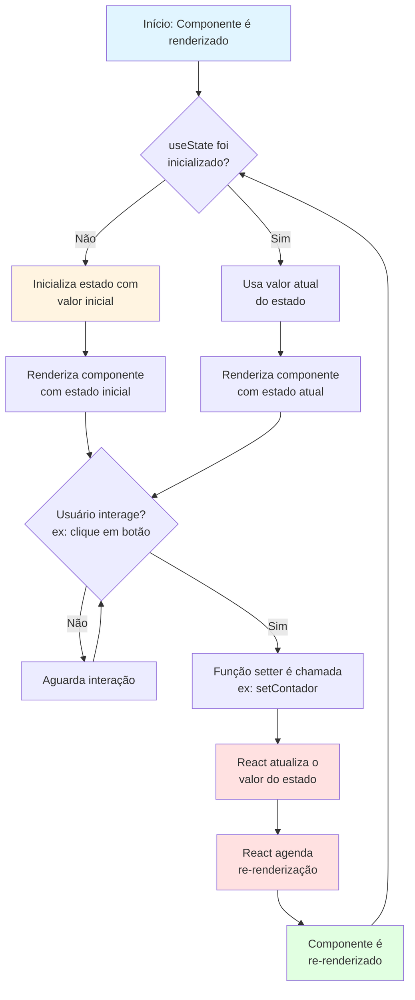
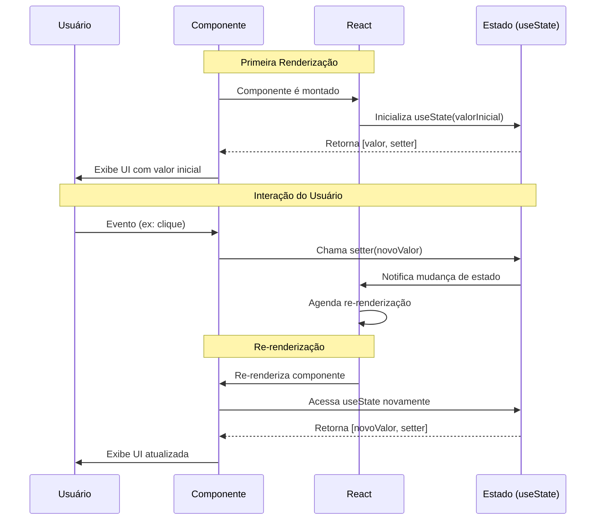

# useState - React Hook

## O que é useState?

O `useState` é um **Hook do React** que permite adicionar estado a componentes funcionais. Ele retorna um array com dois elementos:

1. **Valor atual do estado** - a variável que armazena o estado
2. **Função para atualizar o estado** - função que permite modificar o valor do estado

### Sintaxe

```jsx
const [estado, setEstado] = useState(valorInicial);
```

### Características principais

- **Preservação de estado**: O valor do estado persiste entre re-renderizações do componente
- **Re-renderização**: Quando o estado é atualizado, o React re-renderiza o componente automaticamente
- **Valor inicial**: Pode ser qualquer tipo de dado (string, número, objeto, array, boolean, etc.)
- **Imutabilidade**: O estado não deve ser modificado diretamente, sempre use a função setter

### Exemplo básico

```jsx
import { useState } from 'react';

function Contador() {
  const [contador, setContador] = useState(0);

  return (
    <div>
      <p>Você clicou {contador} vezes</p>
      <button onClick={() => setContador(contador + 1)}>
        Clique aqui
      </button>
    </div>
  );
}
```

## Fluxograma do funcionamento do useState



## Ciclo de vida do useState



## Boas práticas

1. **Nunca modifique o estado diretamente**
   ```jsx
   // ❌ Errado
   estado.push(novoItem);
   
   // ✅ Correto
   setEstado([...estado, novoItem]);
   ```

2. **Use múltiplos useState para estados independentes**
   ```jsx
   const [nome, setNome] = useState('');
   const [idade, setIdade] = useState(0);
   ```

3. **Use função callback para atualizações baseadas no estado anterior**
   ```jsx
   // ✅ Correto para atualizações baseadas no estado anterior
   setContador(prev => prev + 1);
   ```

4. **Agrupe estados relacionados em objetos**
   ```jsx
   const [usuario, setUsuario] = useState({
     nome: '',
     email: '',
     idade: 0
   });
   ```

