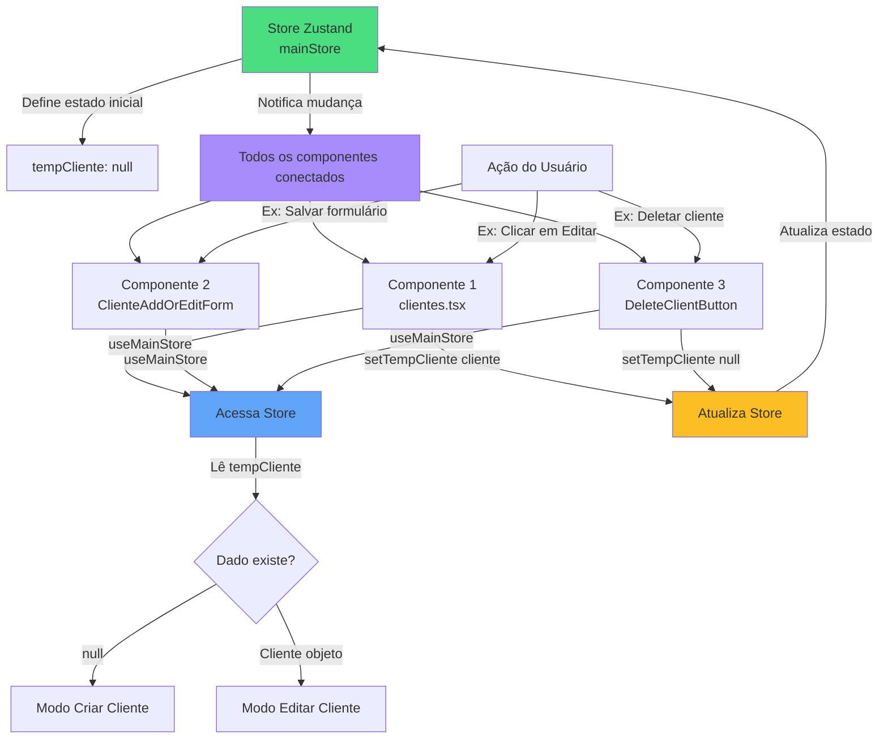

# O que é Zustand?

**Zustand** é uma biblioteca de gerenciamento de estado para React, muito simples e leve. Ela permite que você compartilhe dados entre componentes React sem precisar passar propriedades (props) por vários níveis da árvore de componentes.

## Conceitos Básicos

- **Store (Loja)**: É um lugar centralizado onde você guarda os dados que quer compartilhar entre componentes
- **Hook**: Você usa um hook (como `useMainStore()`) para acessar ou modificar os dados do store
- **Simplicidade**: Diferente do Redux, o Zustand não precisa de Providers ou muita configuração

## Como Funciona na Prática

1. Você cria um store com `create()` do Zustand
2. Define o que vai guardar no store (dados e funções para alterá-los)
3. Qualquer componente pode usar o hook para ler ou modificar os dados
4. Quando os dados mudam, todos os componentes que estão usando aquele dado são atualizados automaticamente

## Exemplo no Projeto

No nosso projeto, temos um store chamado `mainStore` que guarda temporariamente um cliente:

```typescript
// Store guarda: tempCliente
// Função para atualizar: setTempCliente()
```

Qualquer componente pode acessar `tempCliente` ou chamar `setTempCliente()` para atualizar.

---

## Fluxograma: Fluxo de Dados entre Componentes React e Zustand



## Explicação do Fluxo

1. **Store Central (Verde)**: O Zustand mantém um store centralizado com os dados
2. **Componentes Acessam (Azul)**: Vários componentes podem acessar o mesmo store usando `useMainStore()`
3. **Leitura de Dados**: Componentes leem o `tempCliente` para saber se devem criar ou editar
4. **Atualização (Amarelo)**: Componentes podem atualizar o store chamando `setTempCliente()`
5. **Reatividade (Roxo)**: Quando o store muda, todos os componentes conectados são notificados e atualizados automaticamente

## Vantagens

✅ **Simples**: Pouco código para começar  
✅ **Leve**: Biblioteca muito pequena  
✅ **Flexível**: Não precisa de Providers em toda a aplicação  
✅ **Reativo**: Atualiza componentes automaticamente quando dados mudam  
✅ **TypeScript**: Suporte completo a tipos


